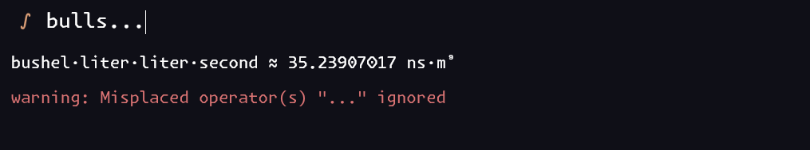
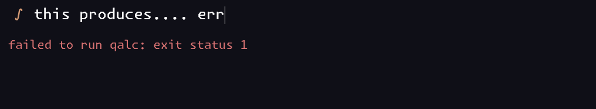

# `Crifo`

Fast rofi-like calculator which uses `qalc` under the hood. Written in `Go`/`Wails` + `React`/`TypeScript`.

## Usage

Simply run the executable

```sh
crifo
```

`Enter` key copies the last output to the clipboard.






## Building from source

You'll need `qalc`, `wails`, `npm`, and `go`. From the root simply run:

```
wails build -clean -o crifo
```

The executable is then produced in `build/bin`.
